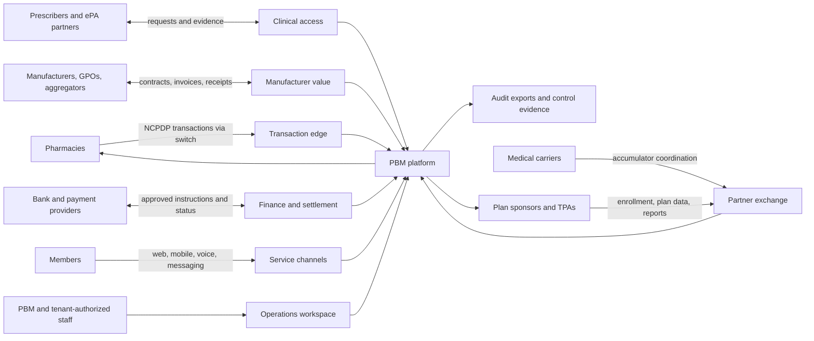
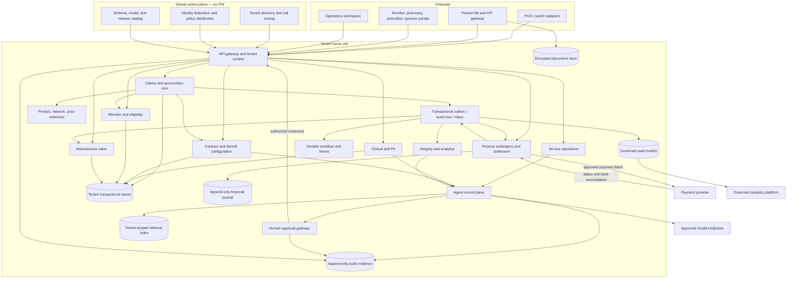
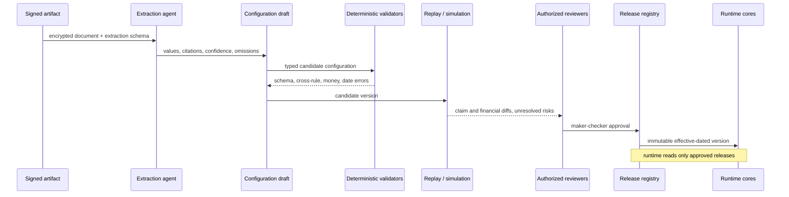

# Target architecture

## 1. Scope and decisions

This is a logical and deployment target for Glass, a highly automated CVS Caremark pharmacy benefit offering for small group employers. The [initiative context](./initiative-context.md) governs commercial scope: TrueCost or Caremark drug-level rebate models, 100% rebate pass-through, explicit service fees, and employer-level isolation. Full-service domains describe capabilities to orchestrate across Glass and Caremark; they are not a mandate to rebuild Caremark infrastructure. It separates three kinds of computation:

1. **Authoritative deterministic cores** calculate claims, clinical rules, money, contractual obligations, and state transitions from versioned inputs.
2. **Model-backed agents** extract, classify, retrieve, summarize, orchestrate bounded workflows, advise, and draft. Their structured outputs are validated proposals.
3. **Humans with delegated authority** approve consequential configuration, clinical determinations, financial release, legal communications, and integrity dispositions.

“AI-native” means workflows are designed so models can safely remove unstructured work while leaving authority, provenance, controls, and a model-off path explicit. It does not mean an LLM adjudicates claims or controls money.

The architecture initially targets commercial pharmacy benefits. It does not assert certification, compliance, throughput, or regulatory approval that has not been demonstrated.

### Caremark integration and launch priority

Reuse authorized Caremark adjudication, network, formulary, clinical, manufacturer contracting, rebate, settlement, and service capabilities through versioned adapters where available. Each integration must identify its system of record, owner, delegated authority, reconciliation contract, and service commitments; no internal API or access is assumed available. Existing Glass engines are prototype/reference capabilities until a production ownership decision is approved.

Prioritize small-group qualification and quoting, standardized benefit packages, automated enrollment and launch certification, employer/member self-service, drug-level cost reporting, and receipt-to-client rebate reconciliation. Track cost to serve, implementation time, exception rate, service quality, and rebate reconciliation completeness; targets need business approval.

## 2. System context



Every edge has an identified data owner, authenticated counterparty, negotiated protocol/version, idempotency scheme, validation/quarantine behavior, and reconciliation owner.

## 3. Component and data flow



### Synchronous claim path

The online claim path is deliberately short and model-free:

1. The transaction adapter authenticates the counterparty, normalizes the negotiated message, derives the tenant, and assigns an immutable transaction/idempotency envelope.
2. The claims core loads the member eligibility, released benefit/contract rules, reference prices, network status, clinical edits, accumulator state, and their exact versions.
3. A deterministic state machine evaluates the transaction and commits the claim event, signed accumulator entries, captured reference values, and derivation trace atomically.
4. The response adapter renders the external response. Transactional outbox records are published asynchronously.
5. Retries return the recorded result for the same counterparty, tenant, transaction identity, and payload hash; conflicting reuse is quarantined.

No event consumer, warehouse, search index, agent, or model endpoint is on this critical path. Dependency loss behavior is explicit per fact: use a valid pinned snapshot only where contractually allowed; otherwise reject or pend with a defined operational reason rather than guess.

### Financial flow

Claims and contractual events produce immutable **financial events**, not mutable invoice totals. The finance context applies effective-dated accounting mappings and posts balanced entries to purpose-specific subledgers:

- pharmacy payable and remittance;
- sponsor receivable, fees, credits, and adjustments;
- manufacturer rebate receivable, collections, disputes, and tenant allocation;
- cash clearing and reconciliation.

Accrual, invoice, approved payment instruction, provider acknowledgement, bank settlement, and cash application are distinct states. Corrections post reversing/adjusting entries. Closed periods are not rewritten. Any general-ledger export is reconciled back to journal entries and source event identifiers.

The platform prepares payment instructions; release requires the configured human approval and payment-provider controls. The architecture does not assume the PBM itself holds funds.

### Configuration flow



The original bytes, content hash, extraction schema/model/prompt versions, field-level citations, edits, approvals, canonical payload, and release hash remain linked. Low confidence is not proof of error and high confidence is not proof of correctness; both are routing signals.

## 4. Context contracts

Each bounded context exposes:

- a synchronous command/query API for cases that require an immediate result;
- versioned events from a transactional outbox;
- an idempotent inbox for consumed messages;
- a tenant-scoped operational store owned by that context;
- immutable audit references for accepted commands and state changes.

Minimum event envelope:

```text
event_id, event_type, schema_version
tenant_id, home_cell_id
aggregate_type, aggregate_id, aggregate_version
occurred_at, recorded_at
correlation_id, causation_id, idempotency_key
actor_type, actor_id, purpose
data_classification, payload, payload_hash
```

Events include only the fields consumers need. PHI-bearing events stay within the tenant cell unless an explicitly governed integration requires otherwise. Ordering is guaranteed only per aggregate; consumers detect gaps and rebuild projections from owned APIs or event history. Delivery is at least once, so handlers must be idempotent.

Cross-context writes use commands, never direct SQL. Read models are disposable projections and visibly carry source freshness and version. Analytics cannot feed an authoritative outcome without returning through a validated command and approval path.

## 5. Tenancy, identity, and PHI isolation

### Tenant model

`tenant_id` represents the contractual data boundary. A tenant may have sponsors, groups, benefit plans, and delegated administrators beneath it; those are authorization scopes, not substitutes for the tenant boundary. Global reference data is either:

- public/licensed reference data with no tenant facts;
- a tenant-specific licensed copy in the tenant cell; or
- a versioned platform artifact that tenants explicitly adopt.

The global tenant directory stores opaque tenant identifiers, routing, cell assignment, and service state. It stores no member identity, claims, clinical evidence, or tenant documents.

### Isolation layers

1. **Routing:** authenticated identity or counterparty configuration resolves a tenant before application code runs. Caller-supplied tenant headers are not trusted by themselves.
2. **Authorization:** every request carries a server-issued tenant context with actor, role, resource scope, purpose, and correlation ID. Default is deny. Object-level checks remain mandatory even when role checks pass.
3. **Application:** repositories require `TenantContext`; APIs without it cannot compile or execute. Cache and idempotency keys begin with tenant and environment.
4. **Database:** every tenant-owned key and unique/index constraint includes `tenant_id`. Database row-level security enforces the session tenant as defense in depth; owner/bypass roles are unavailable to application connections. Higher-risk or larger tenants can receive dedicated databases or cells without changing domain interfaces.
5. **Encryption:** TLS in transit; managed encryption at rest; envelope encryption for documents and selected PHI with keys scoped by environment/cell and, where justified, tenant. Rotation and revocation are rehearsed. Secrets and encryption keys are never put in prompts.
6. **Async:** queue partitions, workflow identifiers, dead-letter handling, outbox/inbox rows, and workers preserve tenant context. A worker must not batch multiple tenants into one model request or unscoped transaction.
7. **Files and retrieval:** object paths, vector/search namespaces, OCR artifacts, temporary files, and signed URLs are tenant-scoped. Retrieval applies authorization before ranking and again before returning chunks.
8. **Telemetry:** structured logs exclude payloads by default. PHI fields are classified and redacted/tokenized before logs, traces, error reports, support tools, and model telemetry. Metrics use bounded labels, not member or claim IDs.
9. **Operations:** support access is just-in-time, purpose-bound, time-limited, approved where required, and audited. Production exports are encrypted, expiring, watermarked where appropriate, and revocable.
10. **Lifecycle:** retention, legal hold, archival, deletion, and backup expiration operate by data class and tenant contract. Deletion is verified across projections, retrieval indexes, object versions, and eligible backups.

Isolation is tested with adversarial tenant-pair fixtures at API, repository, database, cache, event, search, export, agent-tool, telemetry, backup/restore, and operations-console layers. A tenant mismatch fails closed and emits a security event without exposing whether the target object exists.

### Identity

- Workforce and tenant administrators federate through an enterprise identity provider using OIDC or SAML as agreed; strong authentication and lifecycle provisioning are control requirements.
- Service identities use mutually authenticated channels or rotated asymmetric/client credentials with narrow scopes.
- Member, pharmacy, and prescriber identity proofing is channel-specific and risk-based.
- Authorization combines role, tenant/group scope, relationship to the subject, action, purpose, record sensitivity, and workflow state.
- Break-glass access cannot approve its own consequential actions and receives retrospective review.

## 6. Agent architecture and human authority

### Permitted model roles

- extract terms and clinical facts into constrained schemas with citations;
- classify and route inbound documents or cases;
- retrieve authorized records and explain deterministic results;
- plan and orchestrate pre-approved, reversible workflow steps;
- identify anomalies for investigation;
- compare versions and advise on alternatives;
- draft member, provider, sponsor, appeal, or audit communications.

### Prohibited authority

A model cannot independently:

- approve or deny coverage or care;
- calculate the authoritative patient, sponsor, pharmacy, or manufacturer amount;
- alter released rules, eligibility, accumulators, claims, ledgers, or source evidence;
- release money, submit a legal attestation, close an appeal, or make a fraud finding;
- broaden its own tools, tenant scope, data access, or autonomy policy.

### Controlled execution

Each run pins tenant, purpose, agent/prompt/tool/model versions, retrieval policy, input hashes, autonomy policy, budget, and deadline. Tools expose narrow domain operations rather than database access. Tool results are typed and treated as data even when they contain adversarial instructions.

The agent emits one of:

- an answer with authoritative citations and freshness;
- a structured proposal with rationale, evidence, confidence, and expected effects;
- a request for missing information;
- an escalation or refusal.

Deterministic policy validates schema, authorization, allowed state transition, evidence completeness, and consequence class. A human approval gateway enforces role, delegation, segregation of duties, and reason capture. It then creates a fresh domain command; approval never replays arbitrary model-generated SQL or code.

Consequential proposals always require an authorized person. Non-consequential, reversible actions may become eligible for bounded automation only after shadow evaluation, explicit policy approval, monitored rollout, and a tested kill switch.

### Model and data controls

- Use approved endpoints with contractual data-use and retention settings appropriate to the data class; deployment selection follows a documented risk assessment.
- Minimize and tokenize prompts; retrieve only necessary, authorized fields.
- Treat uploaded and retrieved content as untrusted; enforce tool permissions outside the model.
- Separate tenant retrieval indexes and prohibit cross-tenant training or evaluation corpora unless lawfully de-identified and expressly governed.
- Record structured run evidence while excluding hidden reasoning; retain inputs/outputs only according to approved policy.
- Evaluate extraction accuracy by field, citation support, unsupported-statement rate, refusal behavior, tool trajectory, tenant leakage, harmful instruction resistance, and human override/outcome. Aggregate scores do not replace high-risk slice gates.
- Maintain a model-off queue and deterministic/manual workflow for every consequential service.

## 7. Standards and external interfaces

Standards are adapters at the platform boundary, not internal domain models. Exact versions, companion guides, code sets, certification requirements, and trading-partner deviations are selected during implementation and tracked as versioned configuration.

| Interface | Standards/profile direction | Internal boundary |
|---|---|---|
| Pharmacy claim transactions | Applicable NCPDP Telecommunication Standard and trading-partner implementation guides | Normalized claim transaction envelope; preserve original message/hash under retention policy |
| Real-time prescription benefit and electronic prescribing | Applicable NCPDP SCRIPT transactions and implementation guides | Benefit inquiry and prescription workflow APIs; not direct claim mutation |
| Electronic prior authorization | Applicable NCPDP SCRIPT ePA transactions; FHIR-based exchange only where required/agreed | PA case, question set, evidence, determination, and appeal commands |
| Enrollment | ASC X12 834 or validated sponsor API/file contract | Eligibility file/transaction staging, validation, effective-dated coverage commands |
| Accumulator coordination | Trading-partner X12, NCPDP, API, or file agreement as applicable | Idempotent external accumulator entries with source and knowledge time |
| Sponsor billing/remittance and payment status | Applicable ASC X12 transactions where used, plus contract-specific APIs/files | Invoice/remittance documents backed by financial journal identifiers |
| Clinical and administrative data exchange | HL7 FHIR resources and implementation guides selected for the use case; US Core only when applicable | Anti-corruption layer to member, coverage, medication, evidence, and case models |
| Drug, provider, pharmacy, and clinical vocabularies | NDC and other licensed drug data; NPI; RxNorm; ICD-10-CM; SNOMED CT; LOINC; NCPDP identifiers/code sets as licensed/applicable | Versioned terminology service retaining source system, code, version, and effective dates |
| Identity and provisioning | OIDC/OAuth 2.0, SAML, and SCIM as appropriate | Tenant identity, service principal, session, and authorization policy |
| Bulk/object transfer | SFTP or mutually authenticated APIs with PGP/envelope encryption where required | File manifest, control totals, malware scan, quarantine, idempotent ingestion |

FHIR is not used as the internal claims or financial ledger. X12/NCPDP renderings are not treated as the sole retained business state. Adapters preserve control numbers, acknowledgements, original hashes, code-set versions, and round-trip reconciliation.

Every interface definition includes:

- tenant/counterparty resolution and authentication;
- schema and semantic validation;
- control totals and acknowledgements;
- duplicate/conflict policy;
- ordering, timeout, retry, and replay behavior;
- effective date/time-zone and currency conventions;
- PHI classification, retention, and permitted purpose;
- conformance fixtures, negative tests, and reconciliation reports;
- owner, escalation path, and version retirement plan.

## 8. Deployment topology and resilience

The target uses **cells** as the failure and data boundary. Each tenant has one home cell for authoritative writes. A cell contains stateless API/transaction services, workers, workflow/timer infrastructure, transactional databases, journal storage, tenant-scoped object/search services, and an event backbone. Cells can be added without repartitioning all tenants.

The global control plane routes by opaque tenant ID and distributes signed policy/release metadata; it does not process PHI. Cross-region replicas, failover, and data residency are enabled according to validated product baselines and tenant commitments.

Required patterns:

- multi-availability-zone placement where supported and required by the service objective;
- bounded connection pools and bulkheads between online claims, operations, analytics, and model work;
- transactional outbox/inbox rather than distributed transactions;
- circuit breakers and admission control at external dependencies;
- immutable backups, point-in-time recovery, and restore verification;
- declared recovery point and recovery time objectives per context, tested rather than assumed;
- no PHI in build artifacts, global control-plane state, or shared developer fixtures;
- signed, promoted releases for code, rules, schemas, prompts, and model policies;
- canary by internal/synthetic tenant, then explicit tenant cohort, with rollback criteria.

Online adjudication, accumulator correctness, and financial posting receive stricter isolation than dashboards or agents. Model outages degrade extraction/advice queues; they do not interrupt POS adjudication or corrupt authoritative state.

## 9. Data architecture

### Record categories

| Category | Examples | Required behavior |
|---|---|---|
| Source evidence | Signed contract, formulary, criteria, price file, inbound transaction | Immutable bytes/hash, provenance, retention and access policy |
| Released master/configuration | Benefit, contract, network, formulary, MAC, criteria | Effective-dated immutable version, approval, canonical hash |
| Operational aggregate | Member, PA case, service case, appeal | Optimistic version, valid state machine, full change audit |
| Event/ledger | Claim event, accumulator entry, journal posting, cash application | Append-only correction, idempotency, balanced/replayable |
| Projection | Dashboard, search index, sponsor report | Rebuildable, source checkpoint, freshness displayed |
| Agent evidence | Run, tool calls, proposal, review outcome | Version-pinned, tenant/purpose scoped, no authority by itself |

### Time and versioning

All authoritative records distinguish:

- **business/effective time** — when the fact applies;
- **recorded/knowledge time** — when the platform learned it;
- **processing time** — when a workflow acted;
- **version identity** — which code, configuration, terminology, and reference data produced an outcome.

Dates use explicit service-local semantics; timestamps are stored with unambiguous offsets and normalized for comparison. A claim captures the exact benchmark values and rule versions used so later source changes do not rewrite history.

### Money

Internal monetary values use integer minor units plus ISO currency. Rates use scaled integers with named scale. Per-unit prices that require finer precision use a decimal/scaled-integer type, never binary floating point for authoritative calculation. Each rule defines multiplication order and rounding point. Journal postings must balance by transaction and currency; imbalances cannot be published.

This tightens the current Glass convention: existing integer-cent outputs are reusable, while current floating per-unit references need a controlled migration at the authoritative boundary.

## 10. Security, privacy, and compliance engineering

The control program is derived from actual roles, contracts, jurisdictions, and applicable law; this document does not declare compliance. Architecture evidence should support:

- data inventory, classification, purpose limitation, minimum necessary access, and lineage;
- formal risk assessment and third-party/model-provider review;
- access review, workforce lifecycle, segregation of duties, and emergency access;
- secure software supply chain, dependency/image provenance, vulnerability remediation, and secrets management;
- threat modeling for transaction fraud, tenant crossover, prompt injection, document poisoning, insider misuse, payment diversion, and data exfiltration;
- centralized security events with tenant-safe payloads, response playbooks, and breach/incident decision support;
- backup, continuity, disaster recovery, and downtime procedures;
- retention, destruction, legal hold, data-subject/member request handling, and audit export;
- evidence that deterministic and model-backed controls operate as designed.

Production data is prohibited in local development unless explicitly approved and protected. Synthetic fixtures must include multi-tenant collisions and adversarial documents without reproducing real PHI.

## 11. Actionable evolution plan

### Stage 0 — preserve and bound the foundation

- Declare current Postgres records authoritative for the default tenant.
- Wrap `src/lib/engine` with typed `Adjudicate`, `Replay`, and `Explain` ports.
- Introduce domain value objects for tenant identity, effective/knowledge time, money/rates, idempotency, and release identity.
- Turn current invariant, golden, and determinism suites into mandatory release evidence.
- Prohibit agent code from direct domain writes; route current proposals through one authorization gateway.

**Exit:** current behavior is unchanged, all authoritative calls carry a release identity, and consequential agent proposals cannot bypass review.

### Stage 1 — additive multi-tenancy

- Create tenant, tenant hierarchy, identity delegation, and home-cell records.
- Add non-null `tenant_id` through expand/backfill/validate/contract migrations; include it in foreign keys, uniqueness, indexes, jobs, audit, files, and agent records.
- Replace singleton configuration lookup with a tenant-scoped repository while retaining a default-tenant adapter.
- Enable and test database row-level security; remove application database roles that can bypass it.
- Namespace caches, objects, queues, retrieval, telemetry, exports, and idempotency.

**Exit:** automated tenant-pair tests prove isolation across every storage and execution path; a restore can recover one tenant without exposing another.

### Stage 2 — reliable contracts and workflows

- Add transaction envelope, inbox/outbox, schema registry, dead-letter/quarantine, and durable timers.
- Place anti-corruption adapters around POS, enrollment, accumulator, ePA, identity, payment, and reporting interfaces.
- Implement control totals, acknowledgements, duplicate handling, replay tooling, and partner reconciliation.
- Keep services in one deployable where practical; establish context-owned schemas/repositories before extraction.

**Exit:** interface conformance and failure-mode suites pass; every inbound and outbound business effect reconciles.

### Stage 3 — close the commercial and financial loop

- Implement source-artifact-to-release workflow with field citations and maker-checker approval.
- Establish append-only financial event and balanced subledger models.
- Complete sponsor A/R, pharmacy A/P, manufacturer receivable/cash allocation, adjustments, period close, and guarantee measurement.
- Integrate payment preparation/status with dual authorization; test reversal, return, duplicate, and bank mismatch paths.

**Exit:** a closed period reconciles claim-to-remittance, claim-to-sponsor invoice, manufacturer accrual-to-cash, and journal-to-bank/provider status.

### Stage 4 — operational completeness

- Complete eligibility exception, PA/ePA, appeal/grievance, pharmacy help desk/MAC appeal, formulary/network, and member service queues.
- Add SLA timers, delegation, notices, evidence packets, and quality review.
- Build governed sponsor and operations read models from events with visible freshness.

**Exit:** named operations owners can process normal and exception paths without direct database edits.

### Stage 5 — bounded AI at scale

- Deploy extraction, case triage, grounded explanation, variance investigation, and drafting in shadow mode.
- Build tenant- and task-specific evaluation sets, red-team suites, review sampling, and model-off drills.
- Permit only policy-approved reversible actions after measured acceptance; retain human authority for consequential outcomes.
- Track override, unsupported output, leakage, latency, unit cost, queue impact, and downstream outcome by version.

**Exit:** each agent has a current risk assessment, acceptance evidence, least-privilege tools, owner, rollback, kill switch, and manual fallback.

### Stage 6 — cell scaling and selective extraction

- Move tenant cohorts to cells using snapshot plus change capture, shadow comparison, cutover, and reconciliation.
- Extract transaction ingress, document/OCR processing, analytics, or finance only when their scaling/control needs diverge.
- Preserve context APIs and event contracts so extraction changes deployment, not domain behavior.

**Exit:** cell failover/evacuation and tenant migration are rehearsed, and authoritative totals match before and after movement.

## 12. Verification matrix

| Risk | Required proof |
|---|---|
| Wrong claim result | Golden cases, property tests, determinism, replay across versions, duplicate/reversal/rebill suites |
| Wrong money | Integer/decimal boundary tests, rounding fixtures, balanced journal invariant, source-to-bank reconciliation |
| Wrong clinical outcome | Approved criteria fixtures, evidence completeness, deterministic trace, human review and appeal path |
| Tenant crossover | Tenant-pair tests at every layer, RLS tests, cache/search/object/queue leakage tests, redacted telemetry inspection |
| Agent overreach | Tool authorization tests, prompt-injection suites, consequence classification, approval bypass tests, kill-switch drill |
| Unsupported answer | Citation entailment/freshness tests, authoritative-tool comparison, refusal and escalation fixtures |
| Lost/duplicated integration | Idempotency/conflict tests, control totals, ack/retry/replay tests, inbox/outbox reconciliation |
| Unrecoverable service | Restore and point-in-time recovery exercises, workflow replay, key recovery/rotation, cell failover drill |
| Uncontrolled change | Signed release evidence, maker-checker tests, impact simulation, canary and rollback exercise |

Evidence is attached to the exact code, schema, rule, prompt, model policy, and infrastructure release. A dashboard assertion is not proof unless it links to the underlying test or reconciliation artifact.

## 13. Deliberately unresolved decisions

These require measured workload, commercial commitments, and legal/control analysis:

- exact NCPDP, X12, FHIR, terminology, and trading-partner versions;
- jurisdiction and product-specific regulatory obligations;
- tenant placement criteria for shared schema, dedicated database, or dedicated cell;
- service, recovery, retention, and data-residency objectives;
- payment operating model and custody-of-funds responsibilities;
- build-versus-buy choices for switch connectivity, drug knowledge, ePA, payments, contact center, workflow, and model hosting;
- event backbone, workflow engine, key-management, search, and analytics products;
- which reversible agent actions, if any, qualify for automation by tenant.

Record each as an architecture decision with owner, evidence, constraints, review date, and migration consequence before implementation.
